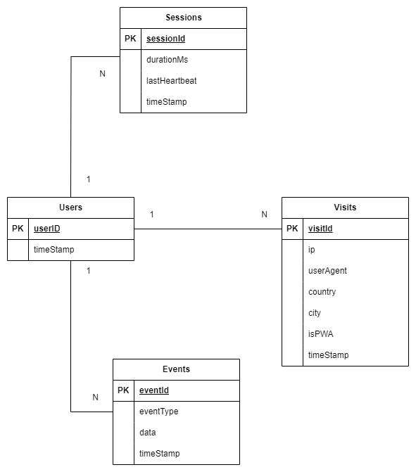

<p align="center">
  
</p>

# Figurio Backend

**Figurio Backend** je serverová časť aplikácie Figurio určená na zber anonymizovaných štatistík používania, agregáciu analytických údajov pre dashboard a spracovanie kontaktného formulára.

Backend je implementovaný ako REST API nad platformou Node.js + Express a využíva MySQL databázu. Poskytuje endpointy pre evidenciu návštev, udalostí používateľov, session metrík a pre výpočty agregovaných metrík (návštevnosť, najpoužívanejšie nástroje, exporty, klávesové skratky, inštalácie PWA a pod.).

---

# Autor

**Pavol Humeny**  
**E-mail:** pavol.humeny@gmail.com  
Vysoké učení technické v Brně - Fakulta informačných technológií  

Projekt vznikol ako súčasť bakalárskej práce:

**Názov práce:** Webová aplikace pro úpravu obrázků  
**Akademický rok:** 2025/2026  
**Ústav:** Ústav počítačové grafiky a multimédií  
**Typ práce:** bakalářská práce  
**Zameranie:** Web  
**Jazyk práce:** slovenský  

**Vedúci práce:** prof. Ing. Adam Herout, Ph.D.

Cieľom práce je návrh a implementácia modernej webovej aplikácie pre manipuláciu s obrázkami so zameraním na prípravu vizuálneho obsahu do odborných textov (LaTeX, Overleaf). Súčasťou riešenia je analýza požiadaviek, návrh používateľského rozhrania, prototypovanie, iteratívne testovanie, integrácia funkčných celkov do výslednej aplikácie a príprava projektu na produkčné nasadenie.

Detail práce (elektronická verzia): https://www.vut.cz/studenti/zav-prace/detail/169466

---

# Verejná verzia aplikácie

Frontend:  
https://pavol-humeny.github.io/figurio/  
https://app.fit.vut.cz/figurio/  


---

# Použité technológie

### Backend
- Node.js
- Express
- body-parser
- cors
- dotenv

### Databáza
- MySQL (mysql2)

### Integrácie
- geoip-lite (geolokácia návštev)
- Resend (odosielanie e-mailov z kontaktného formulára a maintenance notifikácií)

---

# Architektúra backendu

- `app.js` – vstupný bod aplikácie, CORS konfigurácia, registrácia routov, spustenie servera.
- `routes/` – definície REST endpointov.
- `controllers/` – obsluha requestov, validačná logika, SQL dotazy a agregácie.
- `services/db.js` – vytvorenie MySQL connection poolu.
- `services/mailService.js` – e-mailová vrstva (Resend API).
- `initDb.js` – inicializačný skript pre vytvorenie databázových tabuliek.

---

# ERD (Entity Relationship Diagram)

<p align="center">
  
</p>

## Popis entít a vzťahov

- **users** (`userId`, `timestamp`)  
  Eviduje unikátneho používateľa aplikácie.

- **visits** (`visitId`, `userId`, `timestamp`, `ip`, `userAgent`, `country`, `city`, `isPWA`)  
  Eviduje jednotlivé návštevy používateľov a ich základné technické/geografické metadáta.

- **sessions** (`sessionId`, `userId`, `timestamp`, `lastHeartbeat`, `durationMs`)  
  Eviduje trvanie session (heartbeat inkrementy v ms).

- **events** (`eventId`, `userId`, `eventType`, `data`, `timestamp`)  
  Eviduje produktové eventy (upload, export, použitie nástrojov, shortcuty, modaly, inštalácia appky, ...).

- **ratings** (`ratingId`, `userId`, `rating`, `feedback`, `numberOfExports`) 
  Eviduje hodnotenie aplikácie.

### Vzťahy

- `users (1) -> (N) visits`
- `users (1) -> (N) sessions`
- `users (1) -> (N) events`
- `users (1) -> (1) ratings`

---

# API endpointy

## 1) Users (`/api/users`)

### `GET /api/users`
- **Typ:** GET
- **Vstup:** bez parametrov
- **Výstup:** `[{ userId, visitCount }]`
- **Popis:** Zoznam používateľov s počtom návštev.

### `GET /api/users/:userId/visits`
- **Typ:** GET
- **Vstup:** `userId` (path)
- **Výstup:** `[{ visitId, timestamp, ip, userAgent, country, city }]`
- **Popis:** Návštevy konkrétneho používateľa.

### `POST /api/users/:userId/visits`
- **Typ:** POST
- **Vstup:**
  ```json
  {
    "ip": "string (optional)",
    "isPWA": true
  }
  ```
- **Výstup:** text `Visit saved`
- **Popis:** Uloží návštevu; ak používateľ ešte neexistuje, vytvorí ho automaticky. IP vie načítať z tela requestu alebo z hlavičiek.

### `GET /api/users/:userId/events`
- **Typ:** GET
- **Vstup:** `userId` (path)
- **Výstup:** `[{ eventId, eventType, data, timestamp }]`
- **Popis:** Eventy konkrétneho používateľa.

### `POST /api/users/:userId/events`
- **Typ:** POST
- **Vstup:**
  ```json
  {
    "eventType": "string",
    "data": {}
  }
  ```
- **Výstup:** text `Event saved`
- **Popis:** Uloží nový event používateľa.

### `POST /api/users/:userId/sessions`
- **Typ:** POST
- **Vstup:**
  ```json
  {
    "sessionId": "string",
    "incrementMs": 1000
  }
  ```
- **Výstup:** text `Session updated`
- **Popis:** Vloží/aktualizuje heartbeat session (upsert + inkrement `durationMs`).

### `GET /api/users/sessions`
- **Typ:** GET
- **Vstup:** bez parametrov
- **Výstup:** `[{ date, allVisits, minSession, maxSession, avgSession }]`
- **Popis:** Denné agregácie session trvania (v minútach) + počet návštev.

### `GET /api/users/sessionDurationByUser`
- **Typ:** GET
- **Vstup:** bez parametrov
- **Výstup:** `[{ userId, minSession, maxSession, avgSession, totalSessionsTime }]`
- **Popis:** Agregované session metriky podľa používateľa.

### `GET /api/users/:userId/userVisits`
- **Typ:** GET
- **Vstup:** `userId` (path)
- **Výstup:** `{ totalVisits, activeDays, longestStreak, firstVisit }`
- **Popis:** Základné štatistiky návštev používateľa vrátane počtu aktívnych dní a najdlhšej série návštev.

### `GET /api/users/:userId/toolUsage`
- **Typ:** GET
- **Vstup:** `userId` (path)
- **Výstup:** `{ totalInteractions, tools: [{ tool, usage, percentage }] }`
- **Popis:** Štatistika používania nástrojov vhodná pre radar chart.

### `GET /api/users/:userId/eventsStats`
- **Typ:** GET
- **Vstup:** `userId` (path)
- **Výstup:** komplexný objekt s import/export štatistikami, formátmi, veľkosťami a rankingom
- **Popis:** Detailná analytika eventov používateľa vrátane formátov, veľkostí obrázkov a poradia medzi používateľmi.

### `GET /api/users/:userId/sessionStats`
- **Typ:** GET
- **Vstup:** `userId` (path)
- **Výstup:** `{ sessionCount, sessionDuration, totalEvents, eventsPerMinute, perSession, keyboardShortcuts }`
- **Popis:** Štatistiky session používateľa vrátane dĺžky session, eventov a priemerov na session.

### `GET /api/users/:userId/comparison`
- **Typ:** GET
- **Vstup:** `userId` (path)
- **Výstup:** `{ usersCount, metrics: { ... } }`
- **Popis:** Porovnanie používateľa s ostatnými vrátane ranku a najlepších hodnôt v jednotlivých metrikách.
---

## 2) Events analytics (`/api/events`)

### `GET /api/events`
- **Typ:** GET
- **Vstup (query, voliteľné):** `eventType`, `userId`, `dateFrom`, `dateTo`
- **Výstup:** `[{ eventId, userId, eventType, data, timestamp }]`
- **Popis:** Filtrovaný zoznam eventov.

### `GET /api/events/overview`
- **Typ:** GET
- **Výstup:** `{ totalEvents, numberOfUploads, numberOfExport, numberOfKeyboardShortcuts, numberOfUseTool }`
- **Popis:** Súhrnné KPI nad tabuľkou eventov.

### `GET /api/events/toggleTool`
- **Typ:** GET
- **Výstup:** `[{ tool, tab, numberOfToggles }]`
- **Popis:** Počet prepnutí nástrojov podľa názvu nástroja a tabu.

### `GET /api/events/applyOperation`
- **Typ:** GET
- **Výstup:** `[{ tool, numberOfApplies }]`
- **Popis:** Počet aplikovaní operácií podľa nástroja.

### `GET /api/events/uploadImage`
- **Typ:** GET
- **Výstup:** `[{ fileFormat, numberOfUploads }]`
- **Popis:** Štatistika importovaných formátov.

### `GET /api/events/exportImage`
- **Typ:** GET
- **Výstup:** `[{ fileFormat, numberOfExports }]`
- **Popis:** Štatistika exportov podľa formátu, vrátane virtuálneho formátu `copyToClipboard`.

### `GET /api/events/openModal`
- **Typ:** GET
- **Výstup:** `[{ modal, numberOfOpens }]`
- **Popis:** Počet otvorení modálnych okien podľa typu.

### `GET /api/events/keyboardShortcuts`
- **Typ:** GET
- **Výstup:** `[{ keys, numberOfShortcuts }]`
- **Popis:** Použitie klávesových skratiek.

### `GET /api/events/eventsByUser`
- **Typ:** GET
- **Výstup:** `[{ userId, importCount, exportCount, operationCount, toolToggleCount, keyboardShortcutsCount, allEventsCount }]`
- **Popis:** Súhrn eventových metrík podľa používateľa.

### `GET /api/events/appInstalledCount`
- **Typ:** GET
- **Výstup:** `{ appInstalledCount }`
- **Popis:** Počet unikátnych používateľov, ktorí mali event `appInstalled`.

---

## 3) Visits analytics (`/api/visits`)

### `GET /api/visits`
- **Typ:** GET
- **Výstup:** `[{ date, allVisits, newUsers }]`
- **Popis:** Denné návštevy a počet nových používateľov za deň.

### `GET /api/visits/allVisits`
- **Typ:** GET
- **Výstup:** `{ totalVisits }`
- **Popis:** Celkový počet návštev.

### `GET /api/visits/uniqueVisits`
- **Typ:** GET
- **Výstup:** `{ uniqueVisitors }`
- **Popis:** Celkový počet unikátnych návštevníkov.

### `GET /api/visits/lastDaysVisits`
- **Typ:** GET
- **Výstup:** `[{ date, allVisits, newUsers }]`
- **Popis:** Návštevy v dennom reze (zostupne podľa dátumu).

### `GET /api/visits/visitsByCountry`
- **Typ:** GET
- **Výstup:** `[{ country, visitCount }]`
- **Popis:** Počet návštev podľa krajiny.

### `GET /api/visits/byDayFullRange`
- **Typ:** GET
- **Výstup:** `[{ date, allVisits, newUsers }]`
- **Popis:** Denný rad od prvého záznamu po dnešok (vrátane dní bez návštev).

### `GET /api/visits/avgEventsPerVisitByDay`
- **Typ:** GET
- **Výstup:** `[{ date, allVisits, avgUploadImage, avgExportImage, avgApplyOperation }]`
- **Popis:** Priemerný počet vybraných eventov na jednu návštevu za deň.

### `GET /api/visits/visitsByUser`
- **Typ:** GET
- **Výstup:** `[{ userId, visitCount }]`
- **Popis:** Počet návštev podľa používateľa.

### `GET /api/visits/numberOfPWAVisits`
- **Typ:** GET
- **Výstup:** `{ pwaVisits }`
- **Popis:** Počet návštev, ktoré prišli z PWA režimu.

---

## 4) Contact & Maintenance (`/api/contact`)

### `POST /api/contact`
- **Typ:** POST
- **Vstup:**
  ```json
  {
    "name": "string",
    "email": "string",
    "subject": "string",
    "message": "string"
  }
  ```
- **Výstup:** text `Email sent successfully.`
- **Popis:** Odošle kontaktný formulár e-mailom cez Resend.

### `POST /api/contact/:userId/visitDuringMaintenance`
- **Typ:** POST
- **Vstup:**
  ```json
  {
    "ip": "string (optional)"
  }
  ```
- **Výstup:** text `Maintenance visit email sent successfully.`
- **Popis:** Odošle notifikačný e-mail o návšteve počas maintenance módu (s metadátami návštevy).

### `POST /api/contact/:userId/rating`
- **Typ:** POST
- **Vstup:**
  ```json
  {
    "rating": "number",
    "feedback": "string",
    "numberOfExports": "number"
  }
  ```
- **Výstup:** success: true
- **Popis:** Uloží rating do databázy a pošle ho na mail.

---

# CORS 

Povolené originy:
- `https://pavol-humeny.github.io`
- `https://figurio.online`
- `http://localhost:5173`

Povolené metódy: `GET`, `POST`, `PUT`, `DELETE`, `OPTIONS`.

---

# Licencia

Tento projekt je distribuovaný pod licenciou GNU General Public License v3.0 (GPL-3.0) [`LICENSE`](./LICENSE).